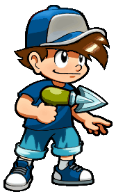
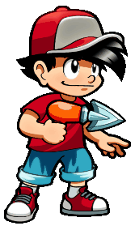
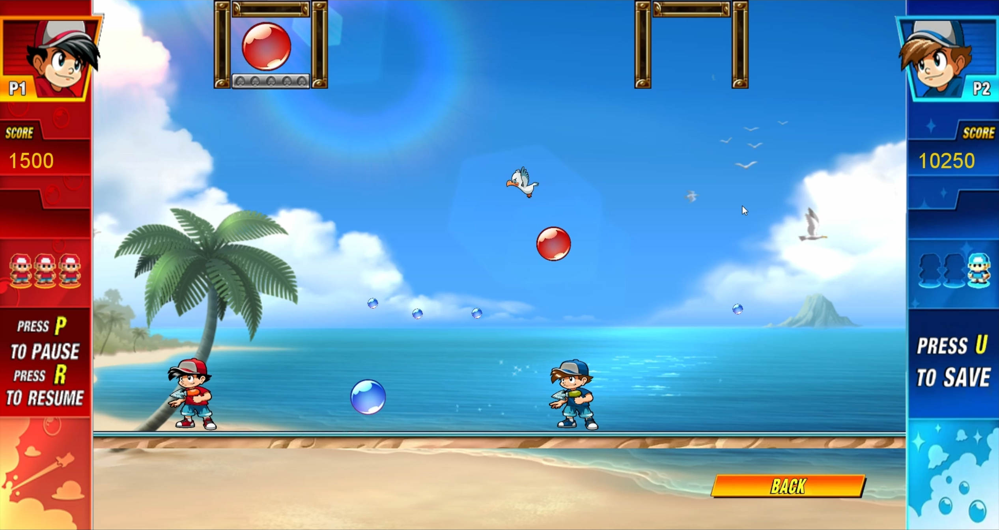
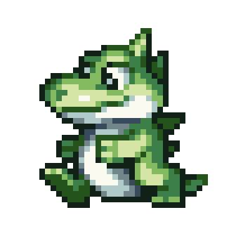

# 🫧 Mini Pang (imitación Super Pang) 🫧
Imitación del mítico juego [Super Pang](https://es.wikipedia.org/wiki/Super_Pang) donde el objetivo es disparar a todas las bolas que aparecen en pantalla pero... ¡Cuidado! Al explotar una bola, ¡ésta se dividirá en dos! Evita que te toquen tres veces para no morir.

Además, habrá una gaviota que te ayudará a destuir las bolas y de las bolas podrán salir vidas.

## Descripción
Videojuego realizado durante el primer año de Grado Superior de Desarrollo de Aplicaciones Multiplataforma + Perfil videojuegos y ocio digital (DAMvi). 

_Incluye:_
- Modo 1 jugador o 2 jugadores.
- Guardado de partida.

## Controles 
###  Player 1 
> Movimiento:
>> Izquierda: [A].   </b> Derecha: [D].
 

> Disparar: [Espacio].  

 
###  Player 2 
> Movimiento:
>> Izquierda: [4].   </b> Derecha: [6].
 

> Disparar: [8].  

#### Controles comunes
> Guardar partida: [U].

> Pausar juego: [P].

> Reanudar juego: [R].

## Requisitos
- 
  
## Tecnologías

## Gameplay

## 💻 Créditos
- Idea y creador del juego original: Mitchell Corporation
- Soundtrack: [Mitchell Coporation](https://downloads.khinsider.com/game-soundtracks/album/super-pang-mitchell-arcade)
- Motor utilizado para la creación del videojuego: Marc Albareda
- Assets/Artwork:
  - [Hervé Barbaresi](https://www.hervebarbaresi.com/pang-adventures)
  - [The Spriters Resource](https://www.spriters-resource.com/snes/superbusterbros/sheet/34370/)
- Edición de algunos assets: Selene Milanés

---------------------
> Este proyecto es una recreación educativa del clásico videojuego Super Pang, desarrollado como parte de mi aprendizaje en el desarrollo de videojuegos con Java. Quiero aclarar que este trabajo es estrictamente no comercial y ha sido creado con fines educativos para mejorar mis habilidades en programación y diseño de juegos.

> Todo el crédito por el juego original Super Pang pertenece a sus respectivos creadores y propietarios. Mi intención con este proyecto no es comercializar, distribuir, o competir con el producto original, sino simplemente rendir homenaje al juego que me inspiró a aprender más sobre desarrollo de videojuegos.
---------------------

> <i>This project is an educational recreation of the classic video game Super Pang, developed as part of my learning process in video game development with Java. I want to clarify that this work is strictly non-commercial and has been created for educational purposes to improve my programming and game design skills.

> All credit for the original Super Pang game belongs to its respective creators and owners. My intention with this project is not to commercialize, distribute, or compete with the original product, but simply to pay tribute to the game that inspired me to learn more about video game development.</i>

 

###  No dudes en contactarme para cualquier duda o inquietud 

